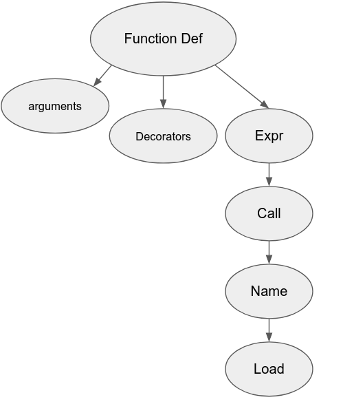
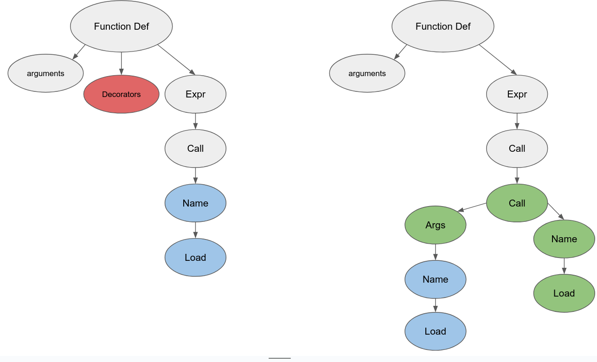

# TL;DR

The following describes the creation of a recursive decorator in Python that automatically applies itself not only to a decorated function but also to all nested (inner) functions within it, and to their nested functions in turn, ad infinitum and ad "au-delà".

To achieve this, the method involves modifying the Abstract Syntax Tree (AST) of the function to inject the decorator dynamically at runtime. That is:

- Using the `ast` module to parse the function's code into an AST, allowing inspection and modification of its structure.
- Identifying and modifying the relevant nodes in the AST to inject the decorator into nested function calls.
- Compiling the modified AST back into executable code and executing it, effectively applying the decorator recursively to all nested functions.

The process requires some basic understanding of Python's AST and a comprehension of dynamic inspection and execution of modified code via `inspect`, `compile`, and `exec`. Passed that, it demonstrates a powerful and fun method for runtime code manipulation in Python.

### Result
```py
import ast
import inspect
import types

def decorator(func):
    def wrapper(*args, **kwargs):
        if isinstance(func, types.BuiltinFunctionType):
            return func(*args, **kwargs)

        print(f"I'm decorating {func.__name__}")

        source_code = inspect.getsource(func)
        func_ast = ast.parse(source_code)
        func_def_node = func_ast.body[0]

        for d in func_def_node.decorator_list:
            if d.id == decorator.__name__:
                func_def_node.decorator_list.remove(d)
                break

        for node in func_def_node.body:
            if not isinstance(node, ast.Expr) or not isinstance(node.value, ast.Call):
                continue

            node_func = node.value.func
            node_args = node.value.args
            node.value = ast.Call(
                func=ast.Call(
                    func=ast.Name(id=decorator.__name__, ctx=ast.Load()),
                    args=[node_func],
                    keywords=[]
                ),
                args=node_args,
                keywords=[]
            )

        ast.fix_missing_locations(func_ast)
        module_compile = compile(func_ast, '<string>', "exec")
        exec(module_compile, globals())

        modified_func = globals()[func.__name__]

        return modified_func(*args, **kwargs)
    return wrapper
```
# Objective

The aim is to apply the same decorator to all inner functions of the decorated function and applying it it on all inner functions of the inners functions and ... in other words have a recursive decorator.

```py
def recursive_decorator(func):
    def wrapper():
            print(f"I'm decorating {func.__name__}")
            ... # some magic code
            return func
    return wrapper

def baz():
    print("I'm baz")

def bar():
    print("I'm bar")
    baz()
        
@recursive_decorator
def foo():
    print("I'm foo")
    bar()


```

```text
> foo()
I'm decorating foo
I'm foo
I'm decorating bar
I'm bar
I'm decorating baz
I'm baz
```

# Methodology

## How to apply a decorator

In Python, decorators can be applied using the `@` symbol

```py
@recursive_decorator
def bar():
    pass
```

or by wrapping the function with the decorator manually:

```py
def bar():
    pass
    
recursive_decorator(bar)
```

But we need to find, at runtime, all the inner functions, decorate them, and then decorate all their inner functions recursively. How can we do that?

## Using AST

An AST (Abstract Syntax Tree) is a data tree representing the structure of a piece of code where each node corresponds to an element of the code such as an expression, statement, function, etc.

With tools provided by the Python Standard Library, we can identify the nodes we want to modify and inject our `recursive-decorator`.

### Peek into the AST

To view the AST, this code snippet can be used:

```python
import ast
def get_ast(code):
    print(ast.dump(ast.parse(code), indent=4))
```

```
get_ast("""
@decorator
def foo():
    bar()
""")
```

```
Module(
    body=[
        FunctionDef(
            name='foo',			# This is our main function
            args=arguments(
                posonlyargs=[],
                args=[],
                kwonlyargs=[],
                kw_defaults=[],
                defaults=[]),
            body=[
                Expr(
                    value=Call(
                        func=Name(id='bar', ctx=Load()), # This is our inner function
                        args=[],
                        keywords=[]))],
            decorator_list=[
                Name(id='decorator', ctx=Load())])], # This is our decorator
    type_ignores=[])

```

#### Simplified Graph



## What would the modified AST look like?

Remember that we need to decorate the inner function

```py
def foo():
    decorator(bar)
```

An easy way to so is to inject in the Call Node another Call Node with the `decorator` as the `func` and `bar` as argument, such as:

```diff
            body=[
                Expr(
                    value=Call(
-                        func=Name(id='bar', ctx=Load()),
+                        func=Call(
+                            func=Name(id='decorator', ctx=Load()),
+                            args=[
+                                Name(id='bar', ctx=Load())],
+                            keywords=[]),
-            decorator_list=[
-                Name(id='decorator', ctx=Load())])],
+            decorator_list=[])],
                       args=[],
                       keywords=[]))],
    type_ignores=[])
```

#### Old graph on the left and new graph on the right



**1) In green: the new node Call with decorator
2) In blue: the node containing the `bar` function
3) In red: the deleted decorator of the main function to avoid cyclical decoration**

# First Draft

## Simple Decorator

We need to return the function definition modified. A simple decorator returning the function would be

```py
def decorator(func):
    def wrapper(*args, **kwargs):
        print(f"I'm decorating {func.__name__}")
        # we'll put the magic code in here
        return func(*args, **kwargs)
    return wrapper

@decorator
def foo():
    print("I'm foo")
```

```text
> foo()
I'm decorating foo
I'm foo
```

## Get the AST object

We need the AST object. We can use `inspect` to get the source code as a string and use `ast` to parse it

```py
import inspect
import ast

func = bar
source_code = inspect.getsource(func) #The `inspect` can get us the source at runtime
func_ast = ast.parse(source_code) # `ast.parse` gets us the `ast` object
```

And the same way as before, we can dump it to visualize the AST:

```
> ast.dump(func_ast, indent=4)
Module(
# ...
```

## Modify the AST

#### Get the `FunctionDef` node

Remember the basic structure:

```
Module(
    body=[
        FunctionDef(
        ...
```

We only need the function definition of `foo`. In other words, what is inside of `Module.body[0]`:

```python
func_def_node = func_ast.body[0]
```

#### Get the `Call` node

No we we have the `FunctionDef` node:

```
        FunctionDef(
        # ...
            body=[
                Expr(
                    value=Call(
                        func=Name(id='bar', ctx=Load()), # This is our inner function
                        args=[],
                        keywords=[]))],
            decorator_list=[
                Name(id='decorator', ctx=Load())])], # This is our decorator
    type_ignores=[])
```

From there we can extract the `Expr` node we want to modify

```python
expr_node = func_def_node.body[0].value
```

```text
Expr(
    value=Call(
        func=Name(id='print', ctx=Load()),
        args=[
            Constant(value="I'm foo")],
        keywords=[]))
```

#### Get the `func` from the `Call` node

From there we can extract the functions and its args

```py
node_func = expr_node.value.func
```

We will use it to inject it as a parameter of our new `Call` node containg the `decorator` function.

### Create the new node

We need to replace the `Call node` with a new `node`. We can again use `ast` to create a node from scratch by passing it the arguments we need, that is another `Call node` which will call the `decorator` and use `bar` as a parameter:

```python
        expr_node.value = ast.Call(
            func=ast.Call(
                func=ast.Name(id=decorator.__name__, ctx=ast.Load()), # the id is the name of the function
                args=[node_func], # node_func is the func we want to wrap with decorator
                keywords=[]
            ),
            args=[],
            keywords=[]
        )
```

### Compile everything or where the magic happens!

Now that we have modified our AST we need a way to make it understanble for the CPython interpreter. To do so, we need to compile it:

```py
        ast.fix_missing_locations(func_ast) 	# 1
        module_compile = compile(func_ast, 'compiled.py', 'exec') 	# 2
        exec(module_compile, globals()) 	# 3

        modified_func = globals()[func.__name__] 	# 4
```

1.  `fix_missing_locations` is to fix the line numbers and the columns offsets that have changed following our ast modification; [documentation](https://docs.python.org/3/library/ast.html#ast.fix_missing_locations)
2.  Compiles a source (normal string, a byte string, or an AST object) into a code object. The filename `compiled.py` is not really significant but helps debugging. And `exex` is the mode; [documentation](https://docs.python.org/3/library/functions.html#compile)
3.  The `exec` will bind (in the first iteration) our main function `foo` with a `code` object (`module_compile`) with a certain context (`globals()`) *(1)
4.  `exec` returns `None`. Therefore, we need to get it directly where it is defined: in the `globals()`

And voilà!

```py
def decorator(func):
    def wrapper(*args, **kwargs):
        print(f"I'm decorating {func.__name__}")

        source_code = inspect.getsource(func)
        func_ast = ast.parse(source_code)
        func_def_node = func_ast.body[0]

        expr_node = func_def_node.body[0]
        node_func = expr_node.value.func
        expr_node.value = ast.Call(
            func=ast.Call(
                func=ast.Name(id=decorator.__name__, ctx=ast.Load()),
                args=[node_func],
                keywords=[]
            ),
            args=[],
            keywords=[]
        )

        ast.fix_missing_locations(func_ast)
        module_compile = compile(func_ast, '<string>', "exec")
        exec(module_compile, globals())

        modified_func = globals()[func.__name__]

        return modified_func(*args, **kwargs)
    return wrapper
```

* * *

<sup>*(1) The difference between a code object, a function object or a frame object can be roughly summarised as:</sup>
<sup>\- code: the most primitive stuff (bytecode: string of one's and zero's)</sup>
<sup>\- function: has a code object and has an env -> static</sup>
<sup>\- frame: has a code object and has an env -> at runtime (runtime representation of a function)</sup>

## Ugh ?

**Indeed...**
If you used the decorator on the following snippet code it certainly didn't work:
```python
def bar():
    print("I'm bar")

@decorator
def foo():
    print("I'm foo")
    bar()
```
But don't worry, there just some little adustments we still need to apply and then it will work just fine!

### Removing the `recursive_decorator` from the `decorator_list`
If we let the recursive decorator in the list of our main decorated function it will call the decorator again failing at `inspect.py` step.
The reason: ```"when the function is called, the decorator runs again - so, it gets some re-entrancy in inspect.getsource, at which points it fails."``` [stackoverflow](https://stackoverflow.com/questions/75696056/pythons-inspect-getsource-throws-error-if-used-in-a-decorator)

There are two solutions:
1) Don't decorate `foo` with `@decorator` but assign `foo = decorator(foo)` before calling `foo`
2) During the AST process, get rid of the recursive decorator from the `decorator_list`

I will choose the second solution so the recursive decorator is applied no matter where we call `foo` from.

```diff
        func_def_node = func_ast.body[0]

+        for d in func_def_node.decorator_list:
+            if d.id == decorator.__name__:
+                func_def_node.decorator_list.remove(d)
+                break

        expr_node = func_def_node.body[0]
```


### Filtering out builtins

Now, if you the snippet code again you will certainly get the error `TypeError: module, class, method, function, traceback, frame, or code object was expected, got builtin_function_or_method`

To avoid it, we need to filter out the builtins functions from the AST modifiation process.

One simple way is to return directly the function when we meet a `builtins` function. You can modify the decorator this way:
```diff
+import types
...
def decorator(func):
    def wrapper(*args, **kwargs):
+        if isinstance(func, types.BuiltinFunctionType):
+            return func(*args, **kwargs)

        print(f"I'm decorating {func.__name__}")
```

### Iterating over (relevant) nodes

It seems to run correctly, but there are still one or two big issues.

If you run the snipped code the result will be:
```text
I'm decorating foo

I'm bar
```
Which is definitely not what we want. And if you simply add a variable assignment it is even worst!
```python
@decorator
def foo():
    x = 5
    print("I'm foo")
    bar()
```
**Error**: `AttributeError: 'Constant' object has no attribute 'func'`

The faulty line is `expr_node = func_def_node.body[0]`. We are accesing **only** the first node of the body. But in a real world scenario there are multiple assignment, calls and so on. In the best case, we don't get an error but we don't process every relevant nodes.

The solution is to iterate to every node and only process the ones of interest. So instead of _assigning_ `expr_node = func_def_node.body[0]` we will _iterate_ over `func_def_node.body`:
```python
        for node in func_def_node.body:
            if not isinstance(node, ast.Expr) or not isinstance(node.value, ast.Call):
                continue

            node_func = node.value.func
            node.value = ast.Call(
                func=ast.Call(
                    func=ast.Name(id=decorator.__name__, ctx=ast.Load()),
                    args=[node_func],
                    keywords=[]
                ),
                args=[],
                keywords=[]
            )
```

### Passing arguments
Everything runs smoothly now. But what if the inner function receives a parameter?

```py
def bar(x):
    print(f"I'm bar and have {x} hours in front of me.")

@decorator
def foo():
    x = 5
    print("I'm foo")
    bar(x)
```
**Error:** `TypeError: bar() missing 1 required positional argument: 'x'`

Just add the arguments in args:
```diff
            node_func = node.value.func
+           node_args = node.value.args
            node.value = ast.Call(
                func=ast.Call(
                    func=ast.Name(id=decorator.__name__, ctx=ast.Load()),
                    args=[node_func],
                    keywords=[]
                ),
+               args=node_args,
                keywords=[]
```

And voilà! (really)

```python
import ast
import inspect
import types

def decorator(func):
    def wrapper(*args, **kwargs):
        if isinstance(func, types.BuiltinFunctionType):
            return func(*args, **kwargs)

        print(f"I'm decorating {func.__name__}")

        source_code = inspect.getsource(func)
        func_ast = ast.parse(source_code)
        func_def_node = func_ast.body[0]

        for d in func_def_node.decorator_list:
            if d.id == decorator.__name__:
                func_def_node.decorator_list.remove(d)
                break

        for node in func_def_node.body:
            if not isinstance(node, ast.Expr) or not isinstance(node.value, ast.Call):
                continue

            node_func = node.value.func
            node_args = node.value.args
            node.value = ast.Call(
                func=ast.Call(
                    func=ast.Name(id=decorator.__name__, ctx=ast.Load()),
                    args=[node_func],
                    keywords=[]
                ),
                args=node_args,
                keywords=[]
            )

        ast.fix_missing_locations(func_ast)
        module_compile = compile(func_ast, '<string>', "exec")
        exec(module_compile, globals())

        modified_func = globals()[func.__name__]

        return modified_func(*args, **kwargs)
    return wrapper

def bar(x):
    print(f"I'm bar and have {x} hours in front of me.")

@decorator
def foo():
    x = 5
    print("I'm foo")
    bar(x)
	
```
```shell
> foo()
I'm decorating foo
I'm foo
I'm decorating bar
I'm bar and have 5 hours in front of me.
```

# Using `ast.Transformers` and Nodes Visitors

This is great for learning. But we could simplify the decorator and make it more readable by using the full set of tools from the `ast` library.

